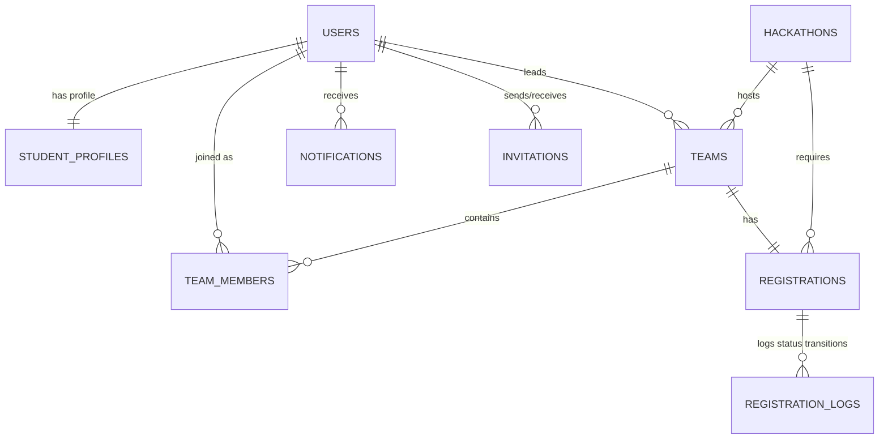

# DBMS Project Report: Concepts & Database Architecture

This document details the database concepts and architectural designs implemented in the **Hackathon Registration & Team Formation Portal**.

---

## 1. Entity-Relationship (ER) Schema Mapping

The database schema maps 11 distinct entities with strong constraint mappings.



### Relationship Constraints
1. **Users (1) ↔ (1) Student_Profiles**: Modeled using `user_id INT UNIQUE` in `Student_Profiles` with `FOREIGN KEY (user_id) REFERENCES Users(user_id) ON DELETE CASCADE`.
2. **Users (1) ↔ (M) Teams**: Team leaders reference `Users.user_id` as `leader_id` in `Teams` using `ON DELETE SET NULL` to preserve team records even if a user account is removed.
3. **Teams (1) ↔ (M) Team_Members**: Resolves many-to-many relationship between `Teams` and `Users`.
4. **Hackathons (1) ↔ (M) Teams**: Teams register for a specific hackathon. Modeled using `FOREIGN KEY (hackathon_id) REFERENCES Hackathons(hackathon_id) ON DELETE CASCADE`.
5. **Teams (1) ↔ (1) Registrations**: Ensures a team has exactly one registration application. Enforced by marking `team_id INT NOT NULL UNIQUE` in the `Registrations` table.

---

## 2. Normalization & 3NF Design

To eliminate redundancy and prevent anomalies (insertion, deletion, update), all tables are structured in **Third Normal Form (3NF)**.

### First Normal Form (1NF)
- All table attributes are atomic.
- Multi-valued attributes like **Student Skills** and **Student Interests** are extracted into separate tables: `Student_Skills` and `Student_Interests`. Rather than storing comma-separated skill lists, we store single skill tokens as separate rows linked back via `user_id`.

### Second Normal Form (2NF)
- All tables satisfy 1NF.
- There are no partial dependencies: every non-prime attribute is fully dependent on the primary key.
- For example, in the composite key tables `Student_Skills(user_id, skill)` and `Student_Interests(user_id, interest)`, there are no other attributes dependent on just `user_id`.

### Third Normal Form (3NF)
- All tables satisfy 2NF.
- There are no transitive dependencies: non-prime attributes do not depend on other non-prime attributes.
- Example: We store `college`, `branch`, and `year` in the `Users` table itself, and social URLs, resume paths, and bios in `Student_Profiles`. `Student_Profiles` doesn't replicate student names or emails. This prevents transitive relationships between user details and profile URLs.

---

## 3. Advanced DBMS Features Implemented

### A. Transactions & Rollback Safety
Transactions guarantee ACID properties (Atomicity, Consistency, Isolation, Durability) for critical workflow states. If any query inside a block fails, the database automatically triggers a rollback to avoid corrupted states.

- **Team Registration (`RegisterTeam`)**:
  ```sql
  START TRANSACTION;
  -- Insert into Teams
  INSERT INTO Teams ...
  -- Add leader to Team_Members
  INSERT INTO Team_Members ...
  COMMIT; -- Rolls back if any constraint fails
  ```
- **Accepting Invitation (`AcceptInvitation`)**:
  Locks tables using `FOR UPDATE` to avoid race conditions (e.g. two users accepting simultaneously, exceeding `max_team_size`).
- **Submit Registration (`SubmitRegistration`)**:
  Checks if deadline is active and if a registration already exists to block duplicate entries.

### B. Automating Business Logic using Triggers
Triggers run automatically on row-level events (`INSERT`, `UPDATE`, `DELETE`) to verify rules and maintain system-wide state consistency.

1. **Auto Team-Size Updates**:
   - `after_team_member_insert` and `after_team_member_delete` run aggregations (`COUNT(*)`) on members, writing the size directly into `Teams.team_size`.
   - If the size matches the maximum allowed for the hackathon (`max_team_size`), the trigger automatically sets `Teams.status = 'Closed'`. If a member leaves, it updates it back to `'Open'`.
2. **Auto Notifications**:
   - `after_invitation_insert` automatically writes an alert into the `Notifications` table for the receiver, meaning the application doesn't have to run dual writes.
3. **Auditing logs**:
   - `after_registration_status_update` logs every state transition in `Registration_Logs` when an admin updates application requests.

### C. Joining tables via Views
Views acts as virtual tables, pre-compiling complex multi-table joins to simplify queries.
1. `Team_Summary_View`: Joins `Teams`, `Hackathons`, and `Users` to supply team data with leader name and hackathon title.
2. `Registration_Summary_View`: Combines registration records with team names and leader contact details for the admin approvals grid.
3. `Active_Hackathon_View`: Filters out drafts and expired deadlines.

---

## 4. Complex SQL Queries (Joins, Group By, Having)

Our **Team Matching Engine** query demonstrates advanced relational algebra, sorting and filtering matching team rows.

```sql
SELECT 
    t.team_id, 
    t.team_name, 
    t.team_size,
    t.status AS team_status, 
    h.title AS hackathon_title, 
    h.max_team_size,
    u.name AS leader_name,
    u.email AS leader_email
FROM Teams t
JOIN Hackathons h ON t.hackathon_id = h.hackathon_id
LEFT JOIN Users u ON t.leader_id = u.user_id
-- Conditional Joins based on filters:
JOIN Team_Members tm2 ON t.team_id = tm2.team_id 
JOIN Student_Skills ss ON tm2.user_id = ss.user_id
WHERE t.hackathon_id = 1 
  AND t.status = 'Open'
  AND ss.skill = 'React'
GROUP BY t.team_id, h.max_team_size, u.name, u.email
HAVING t.team_size < h.max_team_size
ORDER BY t.team_size DESC;
```

### Explanations:
- **`JOIN`**: Chains `Teams`, `Hackathons`, `Users`, and `Student_Skills` tables.
- **`GROUP BY`**: Groups results by `team_id` to aggregate team sizing metrics.
- **`HAVING`**: Performs an aggregate check filtering out teams that have already met or exceeded their allowed capacity limits (`team_size < max_team_size`).
